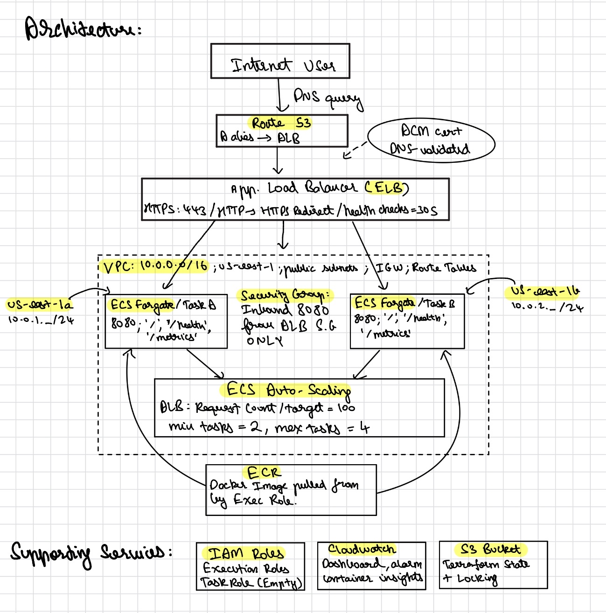

# BitGo SWE InfraOps Architecture

## AWS Endpoint
**Endpoint:** [https://paarth-infra.shop](https://paarth-infra.shop)

## Demo
[Watch the live demo: load test, autoscaling, and fault tolerance](https://vimeo.com/1195234130)

## Architecture

Route 53 resolves paarth-infra.shop to an Application Load Balancer terminating TLS via ACM. The ALB distributes traffic across ECS Fargate tasks in two public subnets across us-east-1a and us-east-1b. IAM roles follow least-privilege as the execution role covers ECR pull and CloudWatch log delivery only; the task role is intentionally empty. Container image is stored in ECR and pulled by the execution role at task startup. CloudWatch Container Insights provides task-level metrics, log delivery via awslogs driver, and a dashboard covering request count, 5xx errors, response time, and running task count. Terraform state is stored remotely in S3 with native file 
locking. 

## Scaling
ECS Application Auto Scaling uses target tracking on ALBRequestCountPerTarget with a target of 100 requests per task per minute. Minimum 2 tasks (one per AZ for fault tolerance), maximum 4. Scale-out cooldown 30 seconds, scale-in stabilization 15 minutes. Verified under 1500 concurrent users generating 708 req/s, zero failures across 223,957 requests with an average response time of 27ms. Fault tolerance was verified by stopping a task mid-load, while the endpoint continued serving without interruption while ECS automatically replaced the stopped task within 90 seconds.

## What's Next
1. Move ECS tasks to private subnets with a NAT gateway. Currently tasks are in public subnets with security groups restricting inbound to ALB only, but private subnets would add defense in depth.
2. Add VPC endpoints for ECR and CloudWatch which keeps traffic off the public internet and reduces NAT costs at scale.
3. Parameterise Terraform variables for region, cluster size, and scaling thresholds, then wrap the entire stack as a reusable module. Currently hardcoded values make multi-environment deployment require manual edits. A proper module with variable inputs would let other teams internally at BitGo spin up identical infrastructure for their own services with a single module {} call.
4. Cost anomaly detection via AWS Cost Anomaly Monitor. BitGo operates at $1M+/month AWS spend; automated cost alerting is table stakes.
5. Setting up a Grafana Cloud account, configuring a Prometheus scrape job targeting ECS task IPs, and building a proper dashboard would have been the ideal observability layer. CloudWatch was the obvious choice here since it satisfied the requirement without the setup overhead.

## Trade-offs
FIS chaos engineering is defined in fis.tf. It stops one ECS task via aws:ecs:stop-task with the CloudWatch 5xx alarm as the stop condition. Properly validating chaos engineering requires multiple experiment runs, observing recovery metrics across each, and tuning the stop condition thresholds. That validation cycle alone would have added 2-3 hours beyond the time budget. The manual task-stop demo achieves the same fault tolerance proof for this submission.
